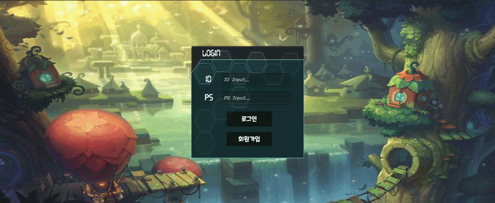
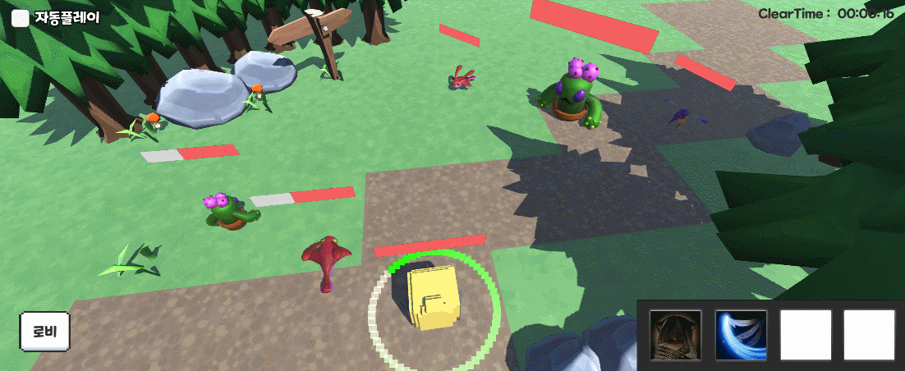
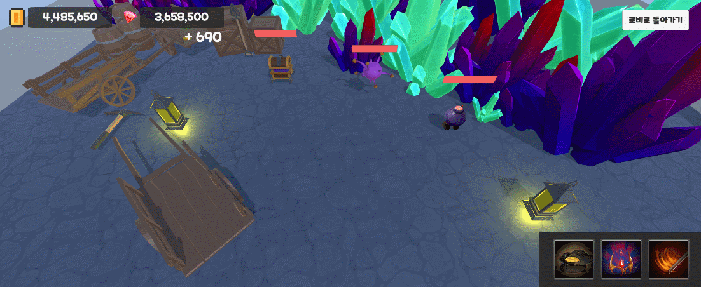
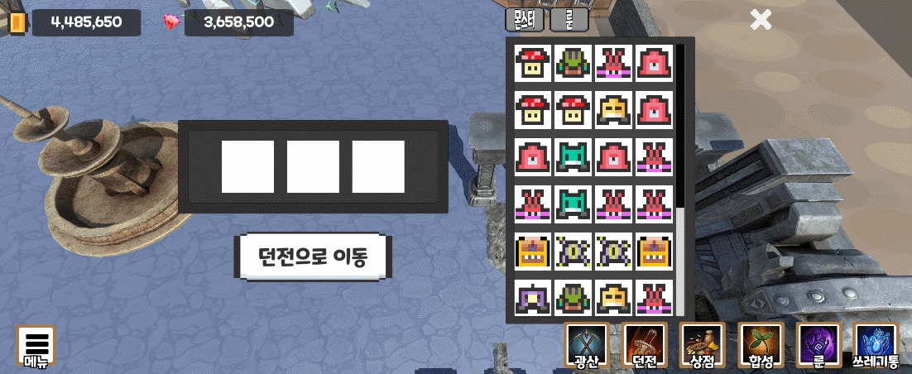
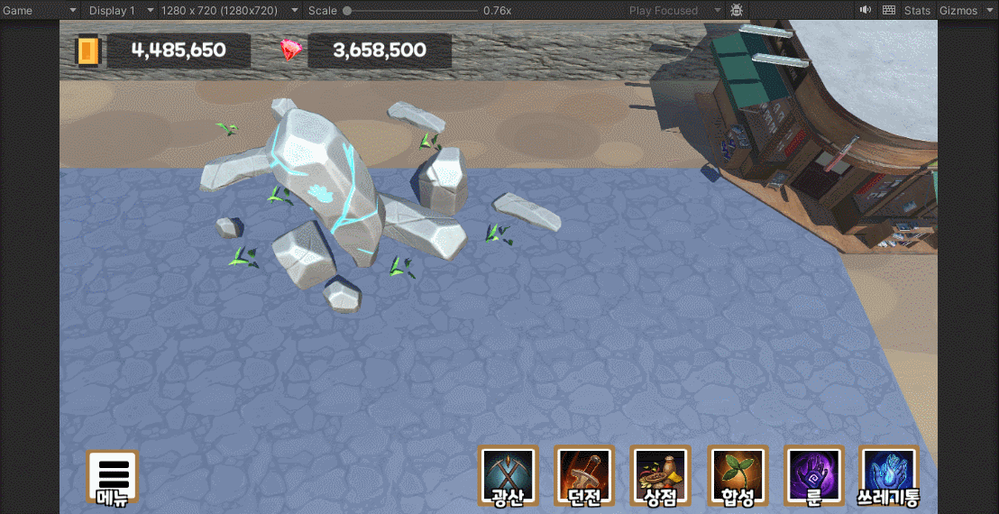
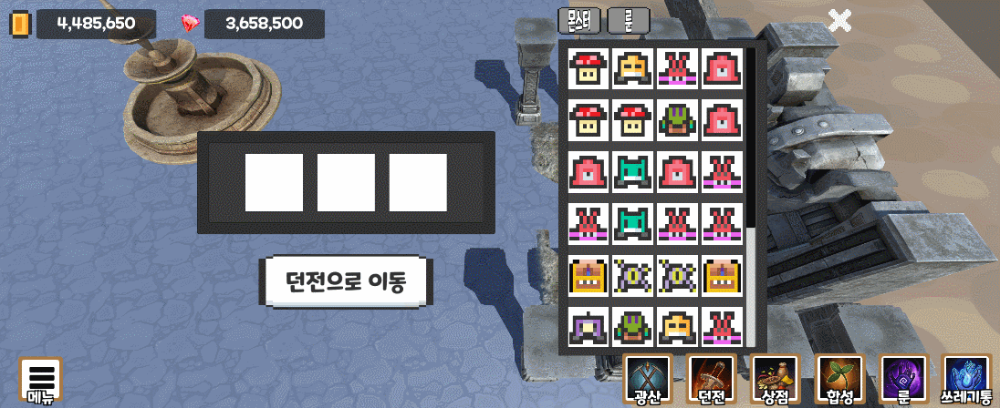
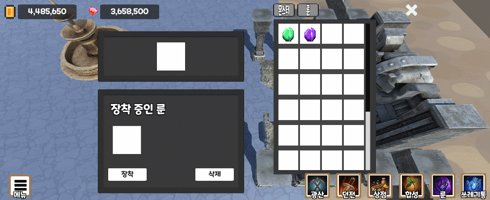
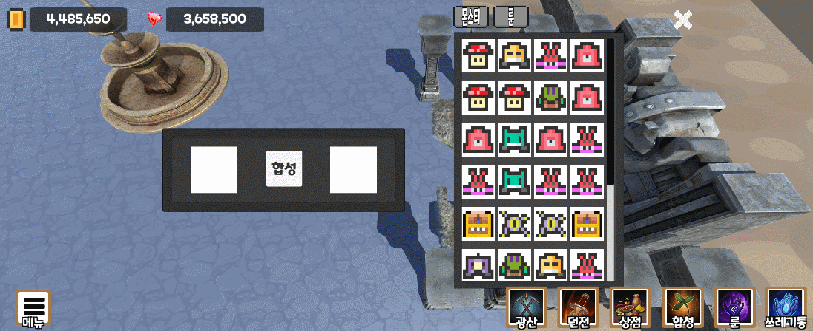
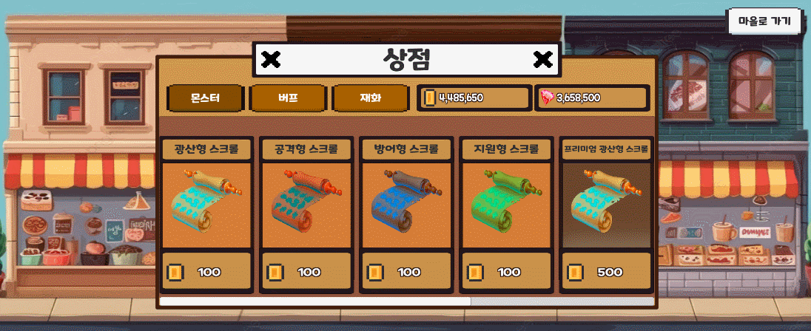

# Forest
## 게임 장르 : 3D 턴제 수집형 RPG 모바일 게임
## 게임 소개 : 여러유형의 몬스터와 룬을 파밍하여 월드를 클리어하는 턴제 방식의 게임입니다. ( PC / 모바일 둘다 가능합니다. )
## 개발 목적 : 평소에 좋아하던 턴제 게임 기능들을 직접 구현 했습니다.
## 사용 엔진 : UNITY 2022.3.15f1
## 개발 기간 : 2024.04.22 ~ 2024.05.20
## 사용 서드파티
- NewtonJSON
- FireBase (Auth, DataBase)
## 포트폴리오 빌드 파일 
- [구글 드라이브 링크 (폰빌드)](https://drive.google.com/file/d/1M6DGcc7NXsxjc8Iiz4H56YeGTWR0rZBu/view?usp=drive_link)
- [구글 드라이브 링크 (컴퓨터빌드)](https://drive.google.com/file/d/1r_VcA_yPS1Dhi6umT22NGmPqBKLu45no/view?usp=drive_link)
- 테스트용 계정 : 1234@1234.1 / 123412
- 빌드파일 실행 시 한글 경로가 있다면 접속이 안될수도 있으므로 주의 부탁드립니다.
## 포트폴리오 에셋 파일 
- [구글 드라이브 링크 (에셋파일)](https://drive.google.com/file/d/1XbgiA8YEmbkuCFdqxQFaWFG1ZAtk1Af7/view?usp=sharing)
## 유튜브 영상 링크
- [유튜브 영상 링크](https://youtu.be/SU8fOyicThc)
## 주요 활용 기술
- #01)(이미지) [Firebase이용한 로그인](https://cafe.naver.com/bbangnity/71)
<details>
<summary>적용 이미지</summary>
  


</details>

***

- #02)(스크립트) [Firebase이용한 데이터베이스 관리](https://cafe.naver.com/bbangnity/86)
<details>
<summary>적용 코드</summary>
  
```
    public void LoadDB()  // 플레이어 데이터를 데이터베이스에서 불러오는 함수
    {
        // UserId에 있는 MonsterInventory 데이터를 데이터베이스에서 불러오기
        reference.Child(FireBaseAuthManager.Instance.UserId).Child("MonsterInven").GetValueAsync().ContinueWith(task =>
        {
            if (task.IsFaulted)
            {
                // 예외 처리
                Debug.LogError("Error getting data: " + task.Exception);
                return;
            }
            if (task.IsCompleted)
            {
                // 데이터를 JSON 형식으로 변환
                DataSnapshot snapshot = task.Result;
                string jsonData = snapshot.GetRawJsonValue();
                // JSON 데이터를 파일에 저장
                string filePath = MonsterDataManager.instance.playermonsterDataPath;
                File.WriteAllText(filePath, jsonData);
                // 파일에서 JSON 데이터 읽기
                string savedJsonData = File.ReadAllText(filePath);

                // JSON 데이터를 몬스터 데이터 리스트로 역직렬화하여 할당
                MonsterDataManager.instance.MonsterInventory = JsonConvert.DeserializeObject<PlayerMonsterData[]>(savedJsonData);
            }
        });

        // UserId에 있는 RuneInven 데이터를 데이터베이스에서 불러오기
        reference.Child(FireBaseAuthManager.Instance.UserId).Child("RuneInven").GetValueAsync().ContinueWith(task =>
        {
            if (task.IsFaulted)
            {
                // 예외 처리
                Debug.LogError("Error getting data: " + task.Exception);
                return;
            }
            if (task.IsCompleted)
            {
                // 데이터를 JSON 형식으로 변환
                DataSnapshot snapshot = task.Result;
                string jsonData = snapshot.GetRawJsonValue();
                // JSON 데이터를 파일에 저장
                string filePath = MonsterDataManager.instance.playerrunestoneDataPath;
                File.WriteAllText(filePath, jsonData);
                // 파일에서 JSON 데이터 읽기
                string savedJsonData = File.ReadAllText(filePath);

                MonsterDataManager.instance.RuneInventory = JsonConvert.DeserializeObject<RuneStone[]>(jsonData);
                // JSON 데이터를 몬스터 데이터 리스트로 역직렬화하여 할당
            }
        });
    }
```

</details>

***

- #03)(스크립트) [NewtonJSON으로 데이터 저장 관리](https://cafe.naver.com/bbangnity/101)
<details>
<summary>적용 코드</summary>
  
```
   public void SaveMonsterData() // 데이터 Json으로 저장시키는 함수
    {
        string jsonString = JsonConvert.SerializeObject(monsters);
        File.WriteAllText(monsterDataPath, jsonString);


        string jsonString3 = JsonConvert.SerializeObject(Abilitys);
        File.WriteAllText(abilityDataPath, jsonString3);

        string jsonString4 = JsonConvert.SerializeObject(runestone);
        File.WriteAllText(runestoneDataPath, jsonString4);
    }
    public void LoadMonsterData2()
    {
            Debug.LogWarning("Monster data file not found."); // 경고 메시지 출력
            TextAsset jsonFile = Resources.Load<TextAsset>("Json/monsterData");
            string jsonData = jsonFile.text;
            monsters = JsonConvert.DeserializeObject<List<MonsterData>>(jsonData);


            Debug.LogWarning("MonsterInventory data file not found."); // 경고 메시지 출력
            TextAsset jsonFile2 = Resources.Load<TextAsset>("Json/abilityData");
            string jsonData2 = jsonFile2.text;
            Abilitys = JsonConvert.DeserializeObject<List<AbilityData>>(jsonData2);

            Debug.LogWarning("runestone data file not found."); // 경고 메시지 출력
            TextAsset jsonFile3 = Resources.Load<TextAsset>("Json/runestoneDataPath");
            string jsonData3 = jsonFile3.text;
            runestone = JsonConvert.DeserializeObject<List<RuneStone>>(jsonData3);

    }
```

</details>

***
- #04)(이미지) [Event Trigger을 이용한 스킬 툴팁 표시](https://cafe.naver.com/bbangnity/88)
<details>
<summary>적용 이미지</summary>



</details>

***

- #05)(이미지) [스킬에 따른 액션 및 파티클 생성](https://cafe.naver.com/bbangnity/95)
<details>
<summary>적용 이미지</summary>


</details>

***

- #06)(스크립트) [Linq를 이용한 몬스터 턴순서 정리](https://cafe.naver.com/bbangnity/74)
<details>
<summary>적용 코드</summary>

```
    void SortByAttackSpeed()
    {
        turnspeed = turnspeed.OrderByDescending(ts => ts.Speed).ToList();

        // 공격속도가 같은 경우를 식별하여 처리
        var groups = turnspeed.GroupBy(ts => ts.Speed);
        foreach (var group in groups)
        {
            if (group.Count() > 1) // 공격속도가 같은 캐릭터가 여러 명인 경우
            {
                // 캐릭터들의 순서를 랜덤하게 섞음
                var shuffledGroup = group.OrderBy(x => Random.value);
                foreach (var ts in shuffledGroup)
                {
                    Debug.Log("Value: " + ts.value + ", Speed: " + ts.Speed);
                }
            }
            else // 공격속도가 같은 캐릭터가 없거나 한 명인 경우
            {
                foreach (var ts in group)
                {
                    Debug.Log("Value: " + ts.value + ", Speed: " + ts.Speed);
                }
            }
        }
    }
```

</details>

***

- #07)(스크립트) [클래스를 이용한 리스트 및 배열 데이터 관리](https://cafe.naver.com/bbangnity/74)
<details>
<summary>적용 코드</summary>

```
    [System.Serializable]
    public class MonsterData // 기본 몬스터 데이터 클래스
    {
    public int Code = -1;
    public int TypeValue = -1; // 0 : 광산 , 1 : 공격, 2 : 방어, 3 : 지원
    public string Imagepath;
    public int Rating;
    public string Name;
    public int Level;
    public float MaxHealth;
    public float NowHealth;
    public float Attack;
    public float Defense;
    public float Attack_Speed;
    public int HasSkill_1 = -1;
    public int HasSkill_2 = -1;
    public int HasSkill_3 = -1;
    public int HasSkill_4 = -1;
    }

    public List<MonsterData> monsters = new List<MonsterData>(); // 몬스터 데이터 리스트

```

</details>

***

- #08)(이미지) [PlayerPrefs을 이용한 플레이어의 BestClearTime 툴팁 표시](https://cafe.naver.com/bbangnity/103)
<details>
<summary>적용 이미지</summary>


</details>

***

- #09)(이미지) [자동전투 시스템](https://cafe.naver.com/bbangnity/74)
<details>
<summary>적용 이미지</summary>


</details>

***

- #10)(이미지) [게임 턴제 배틀 시스템](https://cafe.naver.com/bbangnity/74)
<details>
<summary>적용 이미지</summary>


</details>

***

- #11)(스크립트) [오브젝트 풀링을 이용한 스폰](https://cafe.naver.com/bbangnity/92)
<details>
<summary>적용 코드</summary>

```
using System.Collections;
using System.Collections.Generic;
using UnityEngine;

public class PoolManager : MonoBehaviour
{
    // 몬스터 소환을 위한 풀 매니저 (오브젝트 풀링)

    public GameObject[] prefabs; // 프리팹 배열
    List<GameObject>[] pools; // 프리팹별로 오브젝트를 담을 풀 리스트 배열

    private void Awake()
    {
        // 프리팹 배열 길이만큼 리스트 배열 초기화
        pools = new List<GameObject>[prefabs.Length];

        // 각 프리팹별 리스트 초기화
        for (int i = 0; i < pools.Length; i++)
        {
            pools[i] = new List<GameObject>();
        }
    }

    // 오브젝트 풀에서 비활성화된 오브젝트를 가져오거나 새로 생성하여 반환
    public GameObject Get(int i)
    {
        GameObject select = null;

        // 해당 인덱스의 풀에서 비활성화된 오브젝트를 찾음
        foreach (GameObject item in pools[i])
        {
            if (!item.activeSelf)
            {
                select = item; // 비활성화된 오브젝트를 선택
                select.SetActive(true); // 활성화
                break;
            }
        }

        // 비활성화된 오브젝트를 찾지 못한 경우 새로 생성하여 풀에 추가
        if (!select)
        {
            select = Instantiate(prefabs[i], transform);
            pools[i].Add(select);
        }

        return select;
    }
}

```

</details>

***

- #12)(이미지) [방치형 방식의 광산](https://cafe.naver.com/bbangnity/78)
<details>
<summary>적용 이미지</summary>



</details>

***

- #13)(이미지) [드래그 앤 드랍을 이용한 인벤토리 관리 및 배치 시스템](https://cafe.naver.com/bbangnity/85)
<details>
<summary>적용 이미지</summary>



</details>

***

- #14)(이미지) 피봇과 포지션을 통한 해상도 대처
<details>
<summary>적용 이미지</summary>



</details>

***

- #15)(이미지) [EventSystem을 이용한 건물 클릭 및 씬 이동](https://cafe.naver.com/bbangnity/73)
<details>
<summary>적용 이미지</summary>


</details>

***

- #16)(이미지) [더블클릭 및 더블터치로 몬스터 정보 불러오기](https://cafe.naver.com/bbangnity/80)
<details>
<summary>적용 이미지</summary>



</details>

***

- #17)(스크립트) [텍스트 자동 이동 시스템](https://cafe.naver.com/bbangnity/89)
<details>
<summary>적용 코드</summary>

```
public class TextMove : MonoBehaviour
{
    // 텍스트가 생성되면 저절로 지정한 오프셋으로 이동되게 만드는 스크립트
    public float duration = 2.0f; // 애니메이션 지속 시간
    public float endYOffset = -100.0f; // 끝 Y 오프셋

    private Text textComponent;
    private Vector3 startPosition;
    private float startTime;

    void Start()
    {
        textComponent = GetComponent<Text>();
        // 시작 시간 설정
        startTime = Time.time;
        // 시작 위치 저장
        startPosition = transform.position;
    }

    void Update()
    {
        // 현재 시간에서 시작 시간을 뺀 값의 비율 계산
        float ratio = (Time.time - startTime) / duration;
        // 보간된 Y 위치 계산
        float interpolatedY = Mathf.Lerp(startPosition.y, startPosition.y + endYOffset, ratio);
        // 텍스트 위치 업데이트
        transform.position = new Vector3(startPosition.x, interpolatedY, startPosition.z);

        // 애니메이션 종료 확인
        if (ratio >= 1.0f)
        {
            Destroy(gameObject); // 애니메이션 종료 후 텍스트 게임 오브젝트 삭제
        }
    }
}
```

</details>

***

- #18)(이미지) [화면 자동 이동 시스템](https://cafe.naver.com/bbangnity/75)
<details>
<summary>적용 이미지</summary>


</details>

***

- #19)(이미지) [룬 적용 및 해제](https://cafe.naver.com/bbangnity/96)
<details>
<summary>적용 이미지</summary>



</details>

***

- #20)(이미지) [합성 시스템](https://cafe.naver.com/bbangnity/98)
<details>
<summary>적용 이미지</summary>



</details>

***

- #20)(이미지) [테마별 랜덤 몬스터 소환](https://cafe.naver.com/bbangnity/76)
<details>
<summary>적용 이미지</summary>



</details>

***
